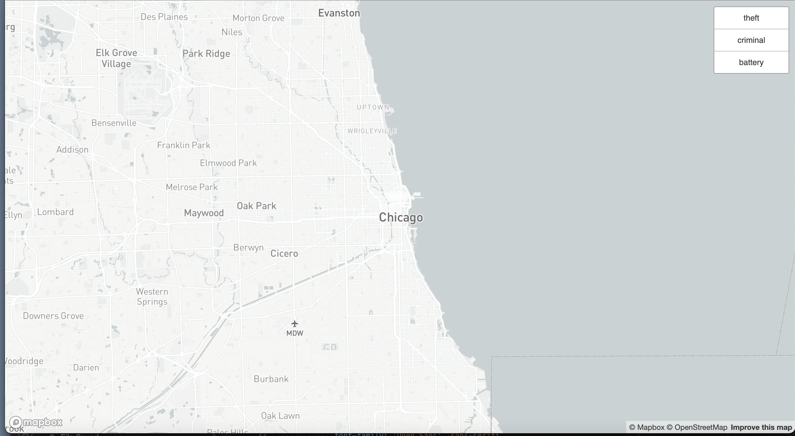
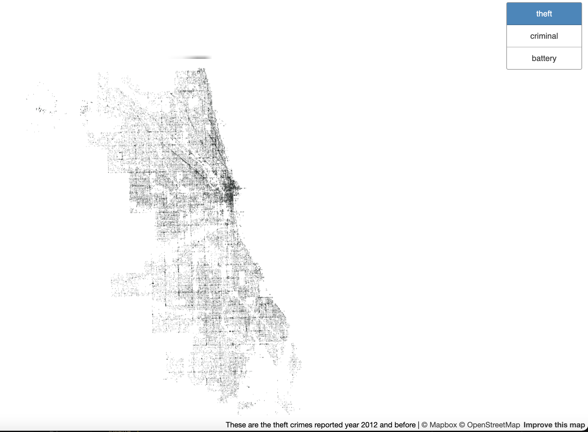
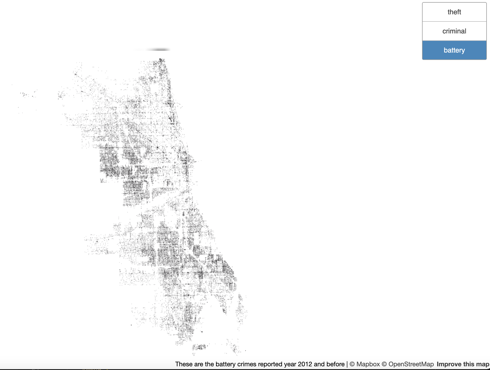
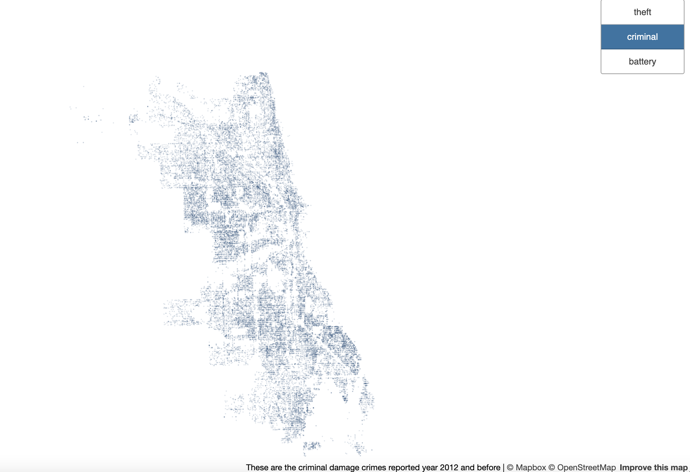

# Lab4
GEOG 458 Course

## Data Overview
This lab was created using the plug in QMeta tiles and using a data set about Reported [Crimes](https://data.cityofchicago.org/Public-Safety/Crimes-2012/hx8q-mf9v/data) in Chicago.
This is the [URL](https://castie2.github.io/Lab4/) to web map page created. The data used was from the City of Chicago. The data displayed on the tiles is in points so there was data cleaning with the pandas library, to find out the top three crimes and data visualizations on QGIS first. The tiles were split into four parts a Chicago basemap with mapbox, and the top three crimes in Chicago, these are 1. Theft, 2. Battery and 3. Criminal Damage

## Map Tiles
Chicago is Examined Geographic Area.

Theft Counts displayed as points

Battery Counts displayed as points

Criminal Damage Counts displayed as points

Available zoom levels for all tile sets are at 9 Zoom Level